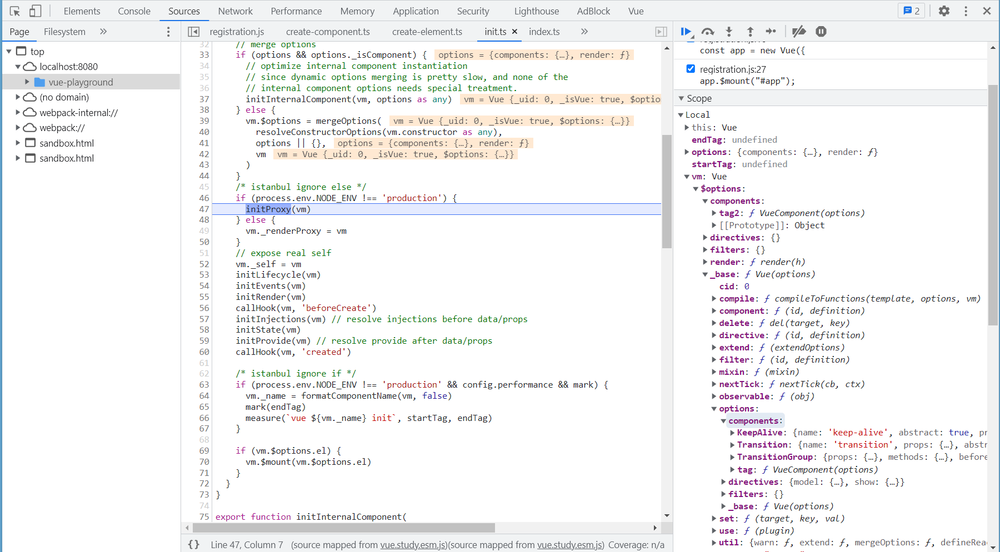
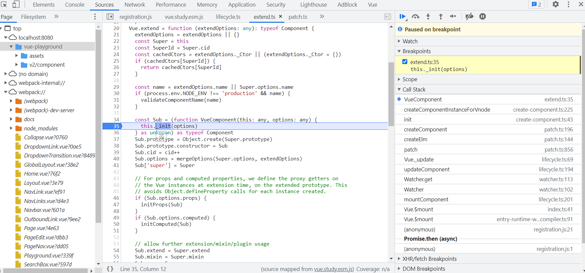

# 组件

## 注册

<<< @/docs/.vuepress/public/v2/component/registration.js

<Playground :code-path="$withBase('/v2/component/registration.js')" :show-iframe="true" />

通过断点可发现全局注册`Vue.component`会调用`this.options._base.extend(definition)`（例子中实际为`Vue.extend`）生成子类构造方法，并将其注册到options上`this.options[type + 's'][id] = definition`，即保存在构造函数的`options.components`中。而私有组件则`mergeOptions`时直接保存在对象`vm.$options`中。



<Collapse>

``` ts{18,23,49}
// src/core/global-api/assets.ts
ASSET_TYPES.forEach((type) => {
  // @ts-expect-error function is not exact same type
  Vue[type] = function (
    id: string,
    definition?: Function | Object
  ): Function | Object | void {
    if (!definition) {
      return this.options[type + 's'][id]
    } else {
      /* istanbul ignore if */
      if (process.env.NODE_ENV !== 'production' && type === 'component') {
        validateComponentName(id)
      }
      if (type === 'component' && isPlainObject(definition)) {
        // @ts-expect-error
        definition.name = definition.name || id
        definition = this.options._base.extend(definition)
      }
      if (type === 'directive' && typeof definition === 'function') {
        definition = { bind: definition, update: definition }
      }
      this.options[type + 's'][id] = definition
      return definition
    }
  }
})


// src/core/global-api/extend.ts
/**
 * Class inheritance
 */
Vue.extend = function (extendOptions: any): typeof Component {
  extendOptions = extendOptions || {}
  const Super = this
  const SuperId = Super.cid
  const cachedCtors = extendOptions._Ctor || (extendOptions._Ctor = {})
  if (cachedCtors[SuperId]) {
    return cachedCtors[SuperId]
  }

  const name = extendOptions.name || Super.options.name
  if (process.env.NODE_ENV !== 'production' && name) {
    validateComponentName(name)
  }

  const Sub = (function VueComponent(this: any, options: any) {
    this._init(options)
  } as unknown) as typeof Component
  Sub.prototype = Object.create(Super.prototype)
  Sub.prototype.constructor = Sub
  Sub.cid = cid++
  Sub.options = mergeOptions(Super.options, extendOptions)
  Sub['super'] = Super

  // ...省略

  return Sub
}
```

</Collapse>

## 创建实例
在组件构造方法中打好断点，观察组件构建流程。回溯调用过程可知渲染`_render`创建的vnode中包含了组件的构造函数和相关参数，在`__patch__`时调用组件构造方法创建组件实例（带`_isComponent`参数）。在`createComponent`创建vnode时使用`installComponentHooks(data)`在vnode.data上绑定了init钩子，这个钩子里有创建组件实例及mount实例的代码。

``` ts{11-15}
init(vnode: VNodeWithData, hydrating: boolean): boolean | void {
  if (
    vnode.componentInstance &&
    !vnode.componentInstance._isDestroyed &&
    vnode.data.keepAlive
  ) {
    // kept-alive components, treat as a patch
    const mountedNode: any = vnode // work around flow
    componentVNodeHooks.prepatch(mountedNode, mountedNode)
  } else {
    const child = (vnode.componentInstance = createComponentInstanceForVnode(
      vnode,
      activeInstance
    ))
    child.$mount(hydrating ? vnode.elm : undefined, hydrating)
  }
}
```

