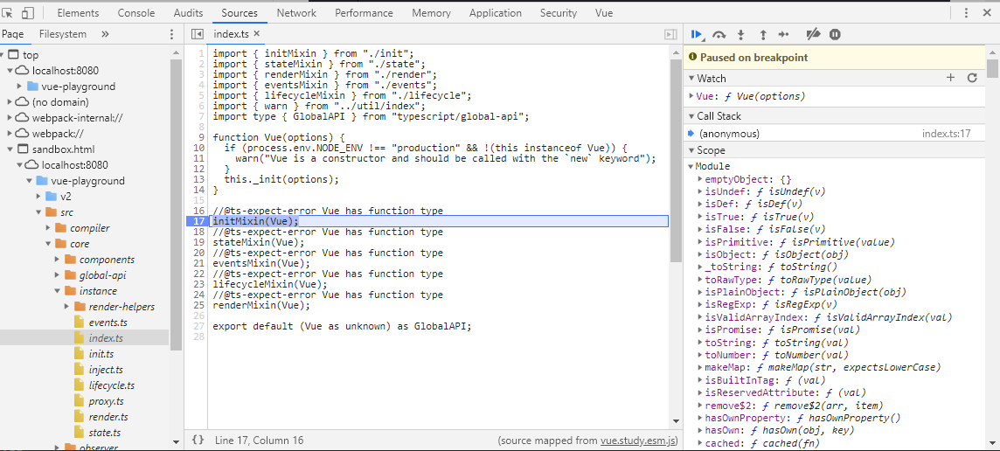
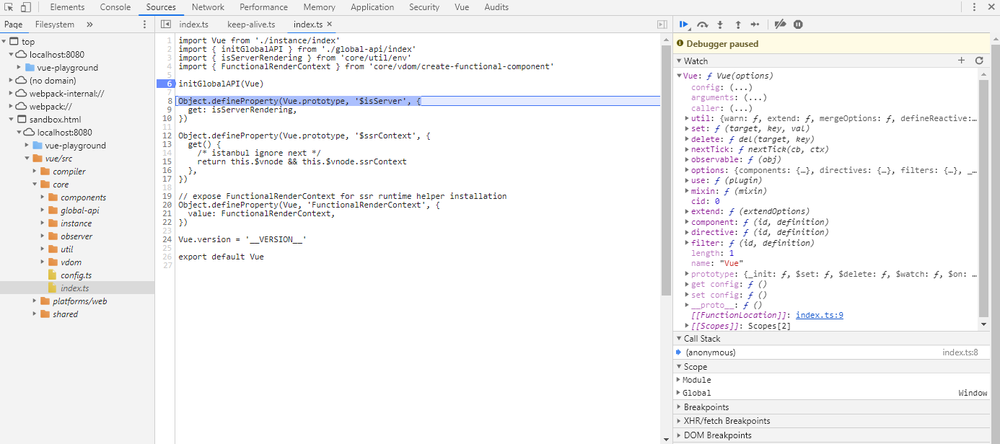
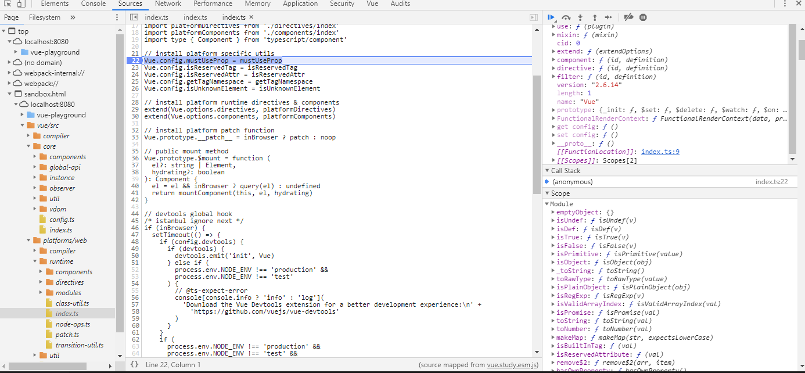
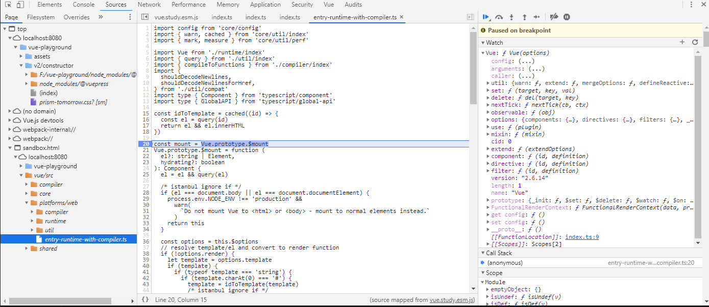

# 构造函数
构造函数Vue的构造过程，这里以runtime+compiler版本为例。依赖路径为`src\platforms\web\entry-runtime-with-compiler.ts` -> `src\platforms\web\runtime\index.ts` -> `src\core\index.ts` -> `src\core\instance\index.ts`。

<<< @/docs/.vuepress/public/v2/constructor/constructor.js

<Playground :code-path="$withBase('/v2/constructor/constructor.js')" />

如下图`src\core\instance\index.ts`中设置断点，观察Vue对象变化可以发现其中主要是在`Vue.prototype`上添加各类方法。

`src\core\index.ts`中，主要在Vue对象上添加了各类方法，同时也在`Vue.prototype`上添加部分属性。

`src\platforms\web\runtime\index.ts`中，主要设置`Vue.config`和`Vue.options`，同时在`Vue.prototype`上添加`__patch__`和`$mount`方法。

`src\platforms\web\entry-runtime-with-compiler.ts`中重置了`Vue.prototype`上的`$mount`方法，同时向Vue对象上添加`compile`方法。
