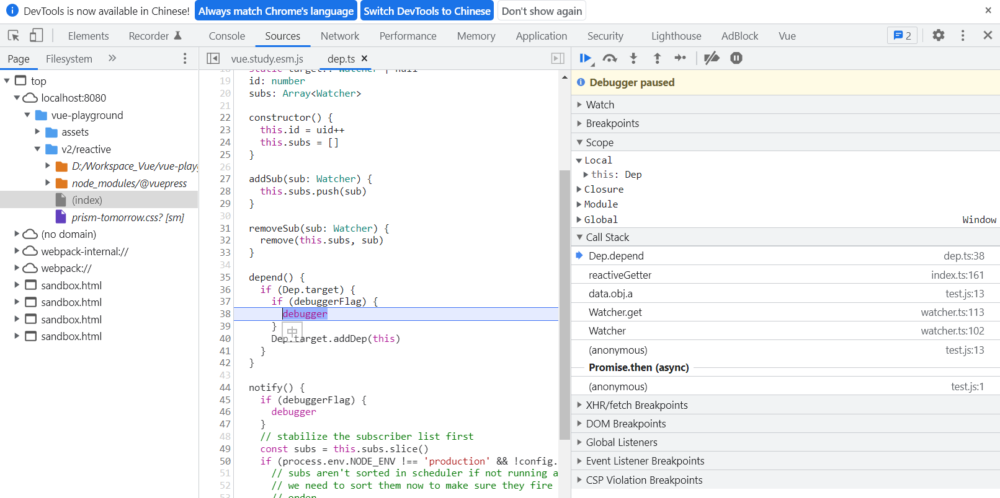

# 前言

本文主要为学习[《深入浅出 Vue.js》](https://www.ituring.com.cn/book/2675)、[《Vue.js 技术揭秘》(V2.x 版本)](https://ustbhuangyi.github.io/vue-analysis/)过程中一些验证实验例子。

使用的 Vue 源码为的 fork 自源码的[V2.6.14](https://github.com/erlangera/vue/tree/study)，该版本已使用 Typescript 替代了 flow。同时为了实验效果作者在源码基础上做出部分修改，同时会打包导出需要的模块及其对应.js.map文件在演示时使用。

```js
import Vue from './entry-runtime-with-compiler';
import { Observer } from '../../core/observer/index';
import Watcher from '../../core/observer/watcher';
import { toggleDebugger } from '../../core/observer/dep';
export { Vue, Observer, Watcher, toggleDebugger };
```

实验需要在开发者模式 Sources 页签下通过断点查看函数间的调用关系。


