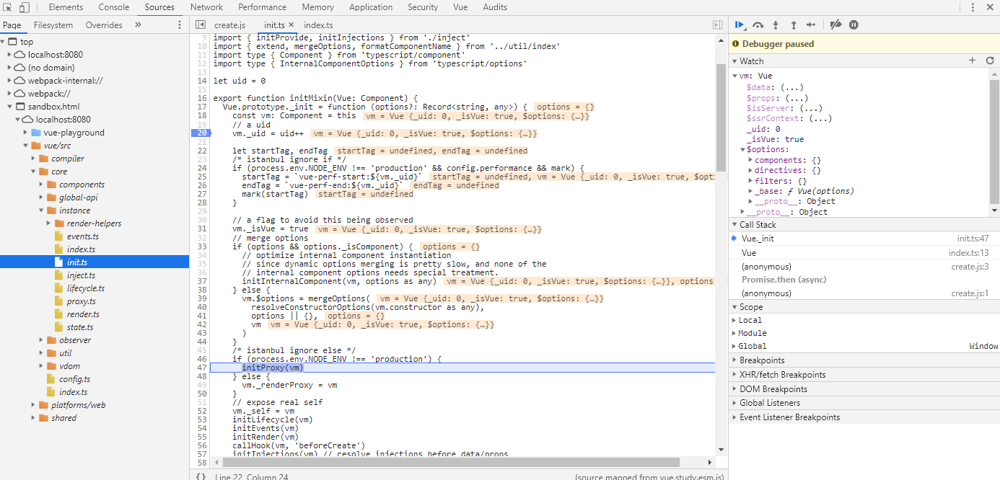

# 生命周期

Vue对象的生命周期流程如下图所示。


## create阶段
典型的是通过`new Vue(options)`创建Vue实例的过程

<<< @/docs/.vuepress/public/v2/lifecycle/create.js

<Playground :code-path="$withBase('/v2/lifecycle/create.js')" />

通过单步调试可以看到最终会执行`src/core/instance/init.ts`中`_init`方法，观察`vm`变化，可以看到vm被添加`_uid`、`$options`等属性和方法。


<Collapse>

``` js
export function initMixin(Vue: Component) {
  Vue.prototype._init = function (options?: Record<string, any>) {
    const vm: Component = this
    // a uid
    vm._uid = uid++

    let startTag, endTag
    /* istanbul ignore if */
    if (process.env.NODE_ENV !== 'production' && config.performance && mark) {
      startTag = `vue-perf-start:${vm._uid}`
      endTag = `vue-perf-end:${vm._uid}`
      mark(startTag)
    }

    // a flag to avoid this being observed
    vm._isVue = true
    // merge options
    if (options && options._isComponent) {
      // optimize internal component instantiation
      // since dynamic options merging is pretty slow, and none of the
      // internal component options needs special treatment.
      initInternalComponent(vm, options as any)
    } else {
      vm.$options = mergeOptions(
        resolveConstructorOptions(vm.constructor as any),
        options || {},
        vm
      )
    }
    /* istanbul ignore else */
    if (process.env.NODE_ENV !== 'production') {
      initProxy(vm)
    } else {
      vm._renderProxy = vm
    }
    // expose real self
    vm._self = vm
    initLifecycle(vm)
    initEvents(vm)
    initRender(vm)
    callHook(vm, 'beforeCreate')
    initInjections(vm) // resolve injections before data/props
    initState(vm)
    initProvide(vm) // resolve provide after data/props
    callHook(vm, 'created')

    /* istanbul ignore if */
    if (process.env.NODE_ENV !== 'production' && config.performance && mark) {
      vm._name = formatComponentName(vm, false)
      mark(endTag)
      measure(`vue ${vm._name} init`, startTag, endTag)
    }

    if (vm.$options.el) {
      vm.$mount(vm.$options.el)
    }
  }
}
```

</Collapse>



## mount阶段
通过vm.$mount调用来实现mount

<<< @/docs/.vuepress/public/v2/lifecycle/mount.js

<Playground :code-path="$withBase('/v2/lifecycle/mount.js')" :show-iframe="true"/>

通过单步调试可以看到最终会执行`src/core/instance/lifecycle.ts`中`mountComponent`方法，通过一个绑定`_update`和`_render`方法`Watcher`来实现首次渲染和动态渲染。

``` js
export function mountComponent(
  vm: Component,
  el: Element | null | undefined,
  hydrating?: boolean
): Component {
  vm.$el = el;
  if (!vm.$options.render) {
    // @ts-expect-error invalid type
    vm.$options.render = createEmptyVNode;
    if (process.env.NODE_ENV !== "production") {
      /* istanbul ignore if */
      if (
        (vm.$options.template && vm.$options.template.charAt(0) !== "#") ||
        vm.$options.el ||
        el
      ) {
        warn(
          "You are using the runtime-only build of Vue where the template " +
            "compiler is not available. Either pre-compile the templates into " +
            "render functions, or use the compiler-included build.",
          vm
        );
      } else {
        warn(
          "Failed to mount component: template or render function not defined.",
          vm
        );
      }
    }
  }
  callHook(vm, "beforeMount");

  let updateComponent;
  /* istanbul ignore if */
  if (process.env.NODE_ENV !== "production" && config.performance && mark) {
    updateComponent = () => {
      const name = vm._name;
      const id = vm._uid;
      const startTag = `vue-perf-start:${id}`;
      const endTag = `vue-perf-end:${id}`;

      mark(startTag);
      const vnode = vm._render();
      mark(endTag);
      measure(`vue ${name} render`, startTag, endTag);

      mark(startTag);
      vm._update(vnode, hydrating);
      mark(endTag);
      measure(`vue ${name} patch`, startTag, endTag);
    };
  } else {
    updateComponent = () => {
      vm._update(vm._render(), hydrating);
    };
  }

  // we set this to vm._watcher inside the watcher's constructor
  // since the watcher's initial patch may call $forceUpdate (e.g. inside child
  // component's mounted hook), which relies on vm._watcher being already defined
  new Watcher(
    vm,
    updateComponent,
    noop,
    {
      before() {
        if (vm._isMounted && !vm._isDestroyed) {
          callHook(vm, "beforeUpdate");
        }
      },
    },
    true /* isRenderWatcher */
  );
  hydrating = false;

  // manually mounted instance, call mounted on self
  // mounted is called for render-created child components in its inserted hook
  if (vm.$vnode == null) {
    vm._isMounted = true;
    callHook(vm, "mounted");
  }
  return vm;
}
```

## update阶段

## destroy阶段