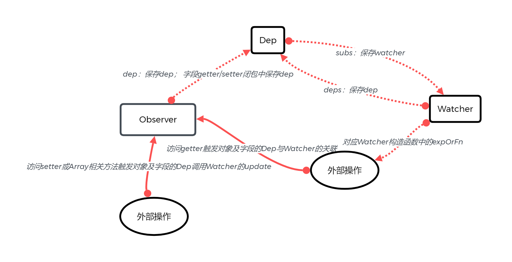
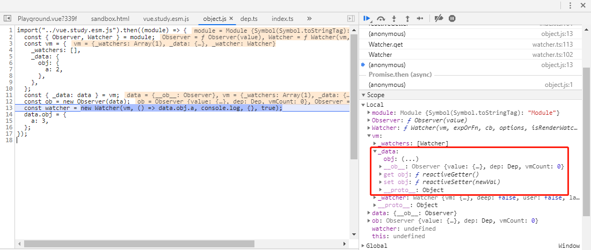
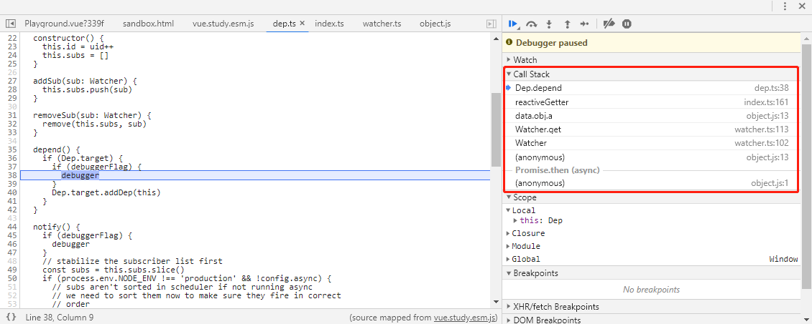
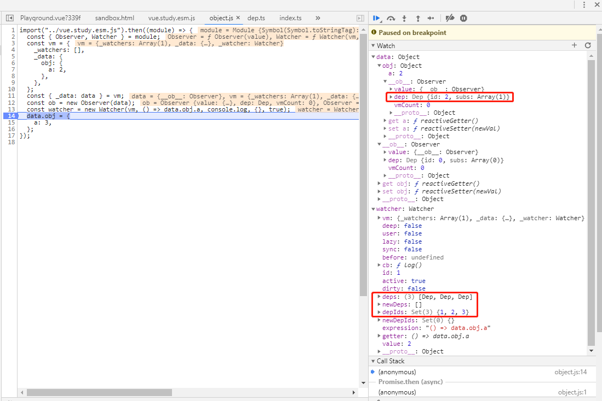
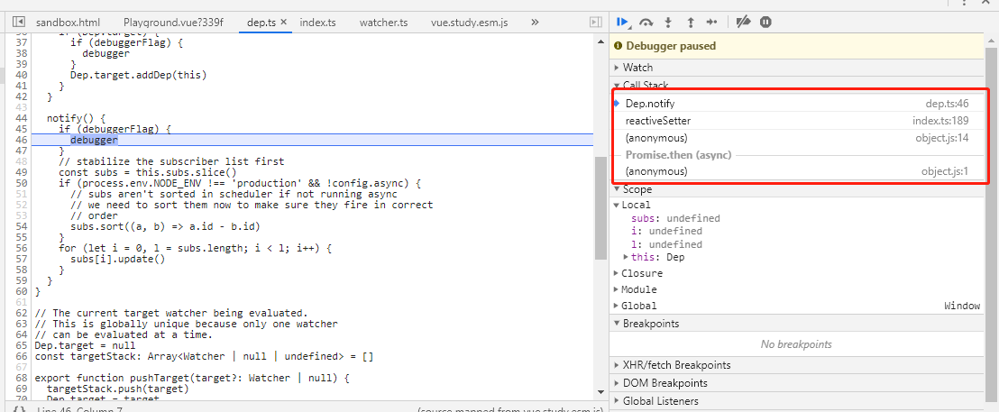
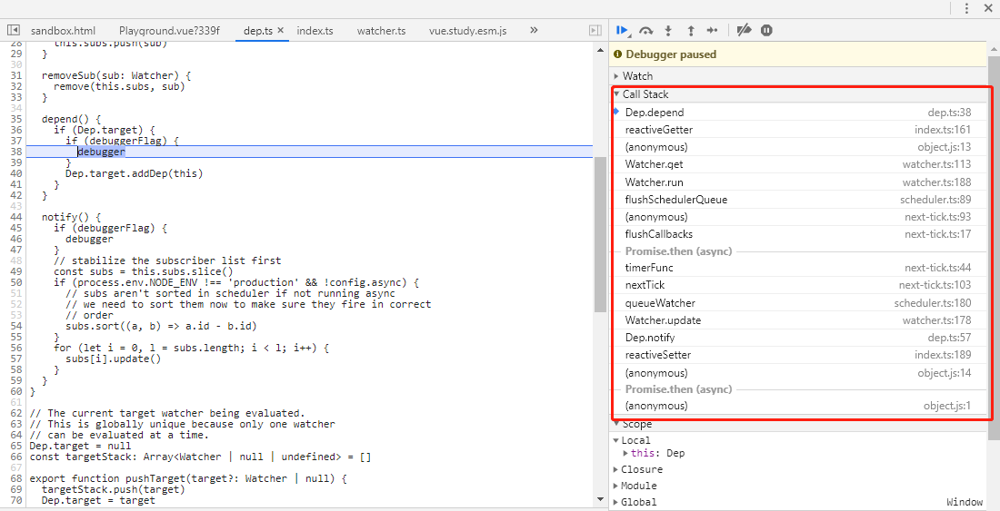
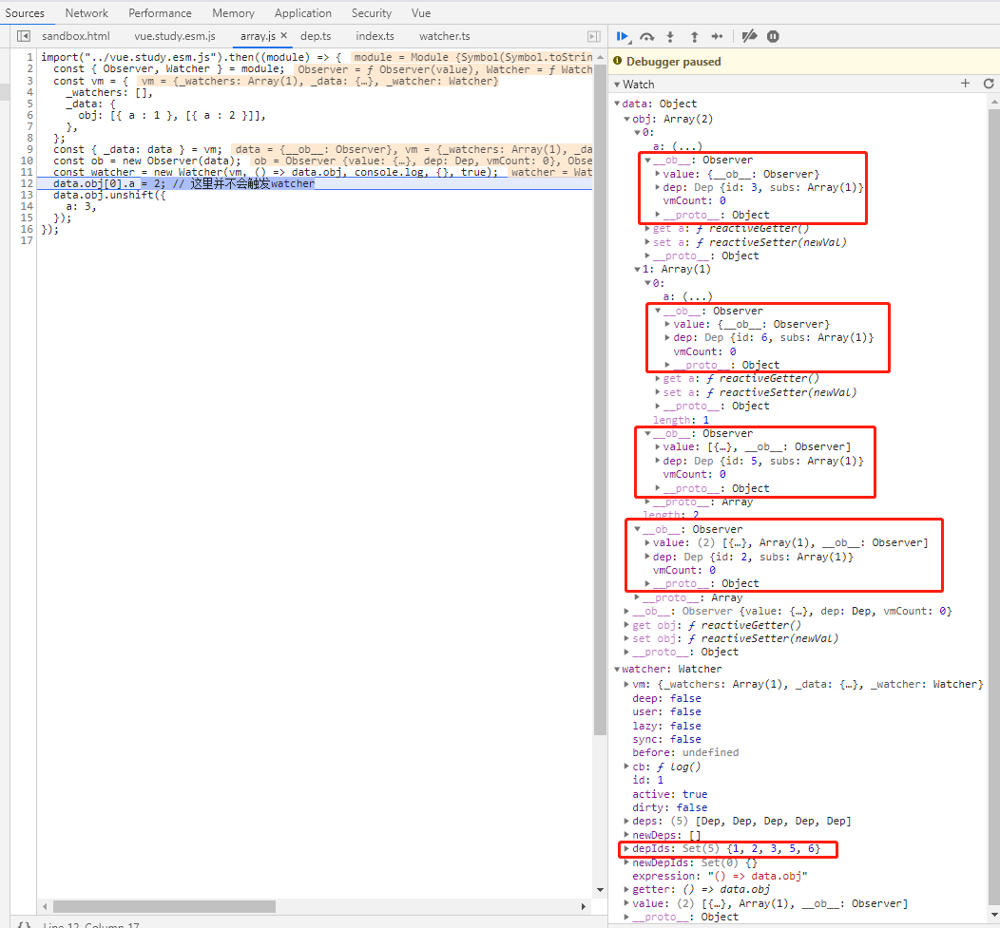

# 响应式原理

响应式原理涉及三个对象`src\core\observer\index.ts`中的`Observer`、`src\core\observer\dep.ts`中的`Dep`和`src\core\observer\watcher.ts`中的`Watcher`，其关系为`Observer`->`Dep`<->`Watcher`

下面为实验代码，主要观察 Observer 后对象变化及响应式原理，这里需要打开浏览器的开发者模式（F12），勾选`Dep断点`会打开`Dep`类的`depend`和`notify`方法中的断点，这里需要调整一下 Call Stack 来观察 Scope 中变量的值。

## 对象

<<< @/docs/.vuepress/public/v2/reactive/object.js

<Playground :code-path="$withBase('/v2/reactive/object.js')" />

如图`Observer`在对象下添加`__ob__`属性同时将属性字段转换为 getter/setter 属性。

而`Watcher`中在执行由`expOrFn`而来的`Watcher.get`时通过设置`Dep.target`并访问`Observer`的相关字段时收集对应的`Dep`依赖，如果配置`deep`时会使用`traverse`遍历`expOrFn`返回结果的所有属性。

下图为执行`() => data.obj.a`收集到的依赖，包括字段`getter/setter`闭包的`Dep`和字段值对应`__ob__`的`Dep`。具体为
1. `data`的`obj`字段的`getter/setter`的`dep`
2. `data.obj`值的`__ob__.dep`
3. `data.obj`的`a`字段的`getter/setter`的`dep`

当数据`data`修改时会调用`setter`方法此时会调用对应字段`Dep.notify`方法，对应的会调用`Watcher.update`方法。而`update`方法最终通过异步队列的方式执行`Watcher.run`方法，这部分读者可结合源码与断点执行情况学习了解。几个比较重要的细节有：
1. 异步队列使用了nextTick
2. 同步多次触发一个Watcher的update只会进一次执行队列
3. `Watcher.run`方法会再次调用`Watcher.get`完成新依赖的收集

## 数组

<<< @/docs/.vuepress/public/v2/reactive/array.js

<Playground :code-path="$withBase('/v2/reactive/array.js')" />

下图为依赖收集结果，可以看到虽然只访问了数组，但是实际数组内所有对象值的依赖也被收集，即当访问值为数组时依赖收集会下探所有子数组元素项。如果对数组元素对象使用`$set/$delete`强制触发`notify`相应`Watcher`也会被触发。
1. `data`的`obj`字段的`getter/setter`的`dep`
2. `data.obj`值的`__ob__.dep`
3. `data.obj[0]`值的`__ob__.dep`
4. `data.obj[1]`值的`__ob__.dep`
5. `data.obj[1][0]`值的`__ob__.dep`

在调用数组特定方法时会触发数组对象__ob__.dep.notify
